<!-- Hero: Monochrome ASCII portrait (types in) beside the Neofetch info card (staggered fade-in).
     Widths are picked so both panels land at the exact same height and align with the heatmap (370 + 490 = 860).
     Portrait: python scripts/prep_photo.py <photo> && python scripts/make_ascii_svg.py
     Info Card: python scripts/make_info_card.py -->

<h3><code>samarpit@github ~ $ whoami</code></h3>

<table>
  <tr>
    <td valign="top"></td>
    <td valign="top"></td>
  </tr>
</table>

  

<!-- Animated contribution graph: real data, boxes reveal cell by cell
     (regenerated daily by .github/workflows/update-profile-art.yml) -->

<h3><code>samarpit@github ~ $ ./contributions.sh</code></h3>

  

<h3><code>samarpit@github ~ $ ./links.sh</code></h3>

<b>Developer & Researcher @ JSAC · Full-Stack & AI Builder · Open Source</b>

 

